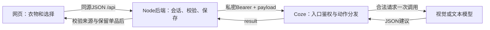

# AI 接入验收 · 2026-10-09

当前是网页接入已部署的 Coze 工作流，尚未发布微信小程序。GitHub 源码已发布，公开网页地址尚未发布。

## 已验证的真实调用

鉴权脚本 `scripts/verify-coze.cjs` 已通过：缺失和错误 Bearer 被拒绝，正确凭证可进入请求校验；无效 action 返回业务错误，不调用模型。

`scripts/test-live-ai.cjs --run` 使用真实 Coze 模型和独立临时数据库，主链路通过：

| 环节 | 本次结果 |
|---|---|
| 图片识别 | 黑色西装；类别upper；无法判断的版型和材质为null；需要人工确认 |
| 确认属性 | 确认后允许进入推荐，模型不能自行确认所有权 |
| 推荐 | 原混合图库返回6套；换为8张授权图库后，相同通勤/平底鞋要求返回2套 |
| 来源与锁定单品 | 参考ID互不重复；录入衣物的名称和itemId保留；每套有真实来源及差异说明 |
| 追问 | 针对方案和步行鞋履要求返回中文回答 |
| 调整 | 版本增加；录入西装和指定下装保留；建议鞋履调整 |
| 保存及反馈 | 保存当前版本的独立快照，重新读取能看到反馈 |
| 访客隔离 | 新会话看不到旧会话计划，读取旧照片返回404 |

本次是API集成测试，不等于已经操作浏览器完成所有页面验收，也不等于在微信真机验收。后续仍需浏览器操作、多件单品、类别冲突图、连续查看更多和最终在线地址的验证。

## 本地回归

三组Node测试通过：输入/图片与模型ID校验，HTTP会话、旧版本拦截、保留单品和计划快照，页面模型文字转义及旧计划引用。

五组标准库Python测试通过：所有执行路径的入口保护、缺失环境变量时拒绝运行、合法/非法模型JSON解析、解析失败返回受控业务错误。没有新增模型重试或自动执行模型文字。

## 结果的边界

- 目前经过真实验收的是单件黑西装。图库主要覆盖女性深色西装参考，不宣称支持任意服饰或男性图库。
- 推荐是用户衣物加模型搭配清单，真实照片不会变成用户的实际衣物。局部照片未展示的鞋或包必须在描述中注明。
- 只有相关照片和条件足够时才可能返回六套；当前授权图库下的本次条件返回两套。数量不足会显示说明，不重复凑数。
- 匹配百分比来自标签规则，不是AI置信度、实际合身概率或所有自由文本要求的验证结果。
- 本次鞋履回答中出现了对舒适度过于肯定的表述。页面已提示实际合身与久走舒适度需要试穿；模型文字不能作为保证。
- 记录依赖匿名Cookie和持久数据库，清除Cookie不能找回原会话。公开部署需要HTTPS及持久存储。
- 公开版已替换旧欢迎页和样式选项图片；用户提供的演示头像单独标注，第三方图片不由项目重新授权。

## 接口的原理

网页没有Token。Coze中的REWEAR_API_TOKEN与后端私密配置一致；仅后端发出Bearer。识图结果需要人工确认。模型负责内容建议，后端负责权限、来源ID、所有权、版本与保存。这些检查共同避免把模型生成内容直接当成可信事实。

真实测试报告在被忽略的`.runtime`下，不随源码公开；报告和数据库都不包含在交付源码中。

公开源码版与本机设计稿的照片素材存在差异，布局和动画保留。示例卡片为实拍穿搭中的西装，人工标注。远端Coze完整平台导出尚未同步，本仓库提供已核对的业务图和入口保护模块；部署脚手架由Coze当前项目生成。

## 公开版新增失败案例

替换示例照片后，以 Commons 的完整穿搭照片进行一次真实识图，工作流返回 invalid_model_output，后端返回502并拒绝保存。没有自动重试，也没有使用预设属性冒充该次识别成功。清晰单品图通过的结果不能扩大为任意整身照片识别稳定。

公开版示例按钮走明确标注的人工示例属性；真实上传仍走模型并需要确认。真实验收脚本现在必须用 --image 指定有权使用的清晰黑西装单品照片，不用参考图库替代识图测试输入。

公开包依赖已按锁文件独立安装成功；已补上 sharp 的构建脚本许可。3组Node和5组Python回归测试通过。Render 服务尚未实际部署；公开网址尚未验收。

独立启动检查通过：交付包直接启动 Node 服务；公开健康接口不泄漏本机目录和PID；错误/缺失 Origin 的写请求返回403；正确同源的人工示例明确 sample=true、confirmed=false；预览HTML和8张授权图片均返回200。该检查未调用模型，不等于浏览器动画或云端部署已验收。
